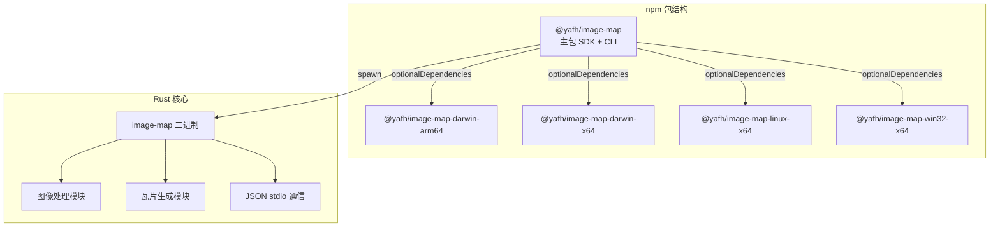
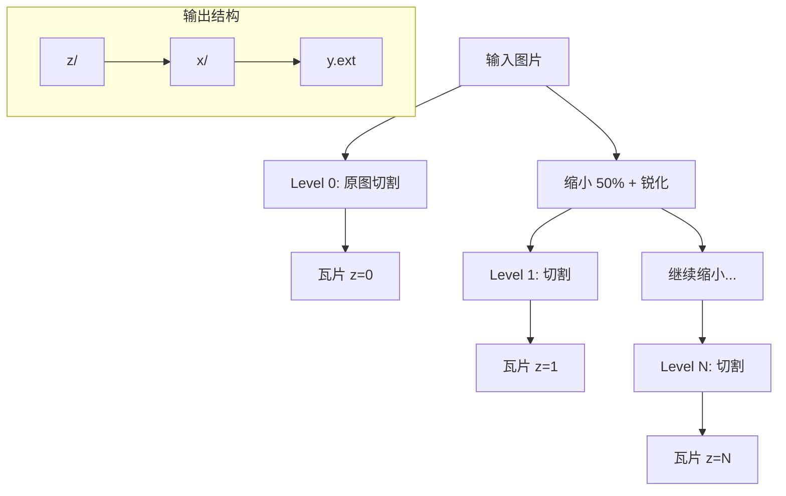
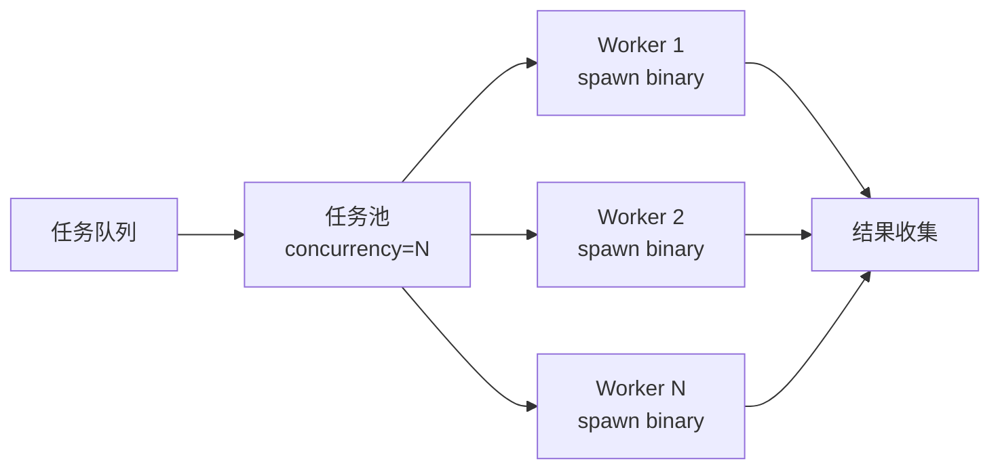

# 图片瓦片生成库实施计划

## 架构概览




## 第一阶段：Rust 核心实现

### 1.1 项目结构调整

重命名并重组 `src-native/` 目录：

```javascript
src-native/
├── Cargo.toml
├── src/
│   ├── main.rs          # CLI 入口，处理 stdio JSON 通信
│   ├── lib.rs           # 库入口
│   ├── tile/
│   │   ├── mod.rs       # 瓦片生成模块
│   │   ├── generator.rs # ZXY 瓦片生成器
│   │   └── config.rs    # 配置结构体
│   ├── image/
│   │   ├── mod.rs       # 图像处理模块
│   │   ├── resize.rs    # 缩放与锐化
│   │   └── encoder.rs   # 编码器（PNG/JPG/WebP）
│   └── protocol/
│       ├── mod.rs       # 通信协议
│       └── message.rs   # JSON 消息定义
```


### 1.2 核心依赖

```toml
[dependencies]
image = "0.25"           # 基础图像处理
fast_image_resize = "5"  # SIMD 加速缩放
rayon = "1.10"           # 并行处理
serde = { version = "1", features = ["derive"] }
serde_json = "1"         # JSON 序列化
clap = { version = "4", features = ["derive"] }  # CLI 参数解析
```


### 1.3 ZXY 瓦片生成算法



**切割中心配置**：支持 `TopLeft`（左上角，Web 地图标准）和 `Center`（中心对齐）。

### 1.4 通信协议设计

采用行分隔的 JSON 消息（NDJSON）：

```json
// 请求
{"type": "generate", "id": "uuid", "input": "/path/to/image.jpg", "output": "/output/dir", "options": {"tileSize": 256, "formats": ["webp"], "origin": "topLeft", "minZoom": 0, "maxZoom": 5}}

// 响应
{"type": "progress", "id": "uuid", "current": 50, "total": 100, "message": "Generating z=3..."}
{"type": "complete", "id": "uuid", "result": {"tilesGenerated": 341, "outputDir": "/output/dir"}}
{"type": "error", "id": "uuid", "error": "File not found"}
```

---

## 第二阶段：交叉编译与分发

### 2.1 目标平台

| 平台 | target triple | npm 包名 ||------|---------------|----------|| macOS ARM64 | aarch64-apple-darwin | @yafh/image-map-darwin-arm64 || macOS x64 | x86_64-apple-darwin | @yafh/image-map-darwin-x64 || Linux x64 | x86_64-unknown-linux-gnu | @yafh/image-map-linux-x64 || Windows x64 | x86_64-pc-windows-msvc | @yafh/image-map-win32-x64 |

### 2.2 交叉编译配置

使用 [cross](https://github.com/cross-rs/cross) 或 cargo-zigbuild 进行交叉编译：

```bash
# 安装 cross
cargo install cross

# 编译各平台
cross build --release --target aarch64-apple-darwin
cross build --release --target x86_64-unknown-linux-gnu
# ...
```


### 2.3 npm 包结构（类 esbuild 方案）

**主包** `@yafh/image-map`：

```json
{
  "optionalDependencies": {
    "@yafh/image-map-darwin-arm64": "1.0.0",
    "@yafh/image-map-darwin-x64": "1.0.0",
    "@yafh/image-map-linux-x64": "1.0.0",
    "@yafh/image-map-win32-x64": "1.0.0"
  }
}
```

**平台包目录结构**：

```javascript
packages/
├── image-map/                 # 主包
│   ├── package.json
│   ├── src/
│   │   ├── index.ts           # SDK 入口
│   │   ├── cli.ts             # CLI 入口
│   │   ├── binary.ts          # 二进制定位逻辑
│   │   ├── pool.ts            # 任务池管理器
│   │   └── protocol.ts        # 消息协议类型
│   └── bin/
│       └── image-map          # CLI shebang 脚本
├── image-map-darwin-arm64/    # 平台包
│   ├── package.json
│   └── bin/
│       └── image-map          # 预编译二进制
└── ...
```

---

## 第三阶段：npm SDK 实现

### 3.1 核心 API 设计

```typescript
// SDK 使用示例
import { ImageMap, createPool } from '@yafh/image-map'

// 单次调用
const result = await ImageMap.generate({
  input: './large-image.jpg',
  output: './tiles',
  tileSize: 256,
  formats: ['webp', 'jpg'],
  origin: 'topLeft',
  minZoom: 0,
  maxZoom: 8,
  onProgress: (current, total) => console.log(`${current}/${total}`)
})

// 池化任务管理
const pool = createPool({ concurrency: 4 })
pool.add({ input: 'image1.jpg', output: 'tiles1' })
pool.add({ input: 'image2.jpg', output: 'tiles2' })
await pool.run()
```


### 3.2 任务池实现

